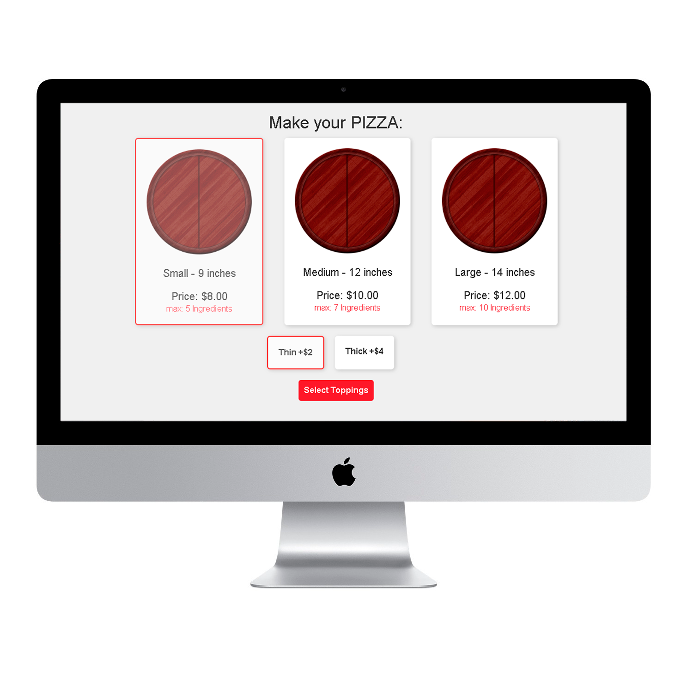

<h1 align="center">
    ZEBU Challenger  | Pizzaria Page
</h1>

<h4 align="center">
  Test Front-end to ZEBU.
</h4>

  

  

 

App specifications:

The app should allow the user to create his own pizza.
Pizza cost will be calculated depending on the size, crust type and amount of extra toppings.
User should first pick the size of the pizza:

 
 

##  WEB

- [React](https://pt-br.reactjs.org/)
- [Expo](https://expo.io/)
- [Typescript](https://www.typescriptlang.org/)
- [Axios](https://github.com/axios/axios) Promise based HTTP client
- [Eslint](https://eslint.org/)
- [Prettier](https://prettier.io/)
- [Redux](https://redux.js.org/)
- [StyledComponents](https://styled-components.com/)

##  TO DO TASKS

- [X] INITIAL CONFIG, ESLINT, PRETTIER, EDITORCONFIG, TYPESCRIPT
- [X] HOME PAGE - 1) SIZE/CRUST  LAYOUT/STYLES WITH MOCK,
- [X] Page 2) Toppings LAYOUT/STYLES WITH MOCK,
- [X] Page 3) Chek yout Custom pizza
- [X] Config Context
- [X] Toast Component
- [X] Context Logic
- [X] Check and Review Application
- [X] Check Layout

## Next
- [ ] Edit toppings, Remove.
- [ ] Unit Tests Jest
- [ ] Make Responsive
- [ ] Back-end

## Install
- Install: Node JS, React JS .
- Download or clone this Repository.
- npm install ou yarn to download dependecies.
- npm start yarn start to init

